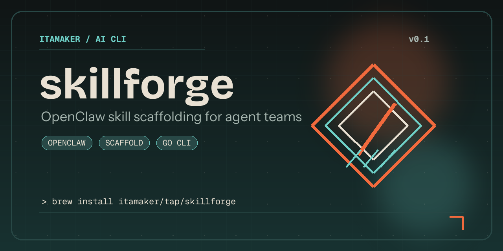

# skillforge

[](#contributors-)

`skillforge` is a Go CLI that scaffolds OpenClaw-ready skill directories from a compact JSON spec.

It helps agent teams standardize skill packaging without building a separate UI or internal generator service.



## Support

[](https://buymeacoffee.com/amaker)

## Quickstart

### Install

Install with your preferred method:

```bash
# From the custom tap
brew tap itamaker/tap https://github.com/itamaker/homebrew-tap
brew install itamaker/tap/skillforge
```

```bash
# Or install from source
go install github.com/itamaker/skillforge@latest
```

<details>
<summary>You can also download binaries from <a href="https://github.com/itamaker/skillforge/releases">GitHub Releases</a>.</summary>

Current release archives:

- macOS (Apple Silicon/arm64): `skillforge_0.1.0_darwin_arm64.tar.gz`
- macOS (Intel/x86_64): `skillforge_0.1.0_darwin_amd64.tar.gz`
- Linux (arm64): `skillforge_0.1.0_linux_arm64.tar.gz`
- Linux (x86_64): `skillforge_0.1.0_linux_amd64.tar.gz`

Each archive contains a single executable: `skillforge`.

</details>

If the repository is still private, release-based installs require GitHub access to the repository assets.

### First Run

Run:

```bash
skillforge init -spec examples/skill.json -out /tmp/research-skill
```

The generated directory includes:

- `SKILL.md`
- `manifest.json`
- `bin/README.md`
- `examples/usage.md`

## Requirements

- Go `1.22+`

## Run

```bash
go run . init -spec examples/skill.json -out /tmp/research-skill
```

Use `-force` if you want to overwrite an existing output directory.

## Build From Source

```bash
make build
```

```bash
go build -o dist/skillforge .
```

## What It Does

1. Loads a compact JSON skill spec.
2. Validates required fields such as `name`, `description`, and `tools`.
3. Generates a portable skill folder with docs and manifest files.
4. Produces output that can be moved into OpenClaw-style agent workspaces.

## Notes

- Use `examples/skill.json` as a starting point for new skill definitions.
- Maintainer release steps live in `PUBLISHING.md`.

## Contributors ✨

| [![Zhaoyang Jia][avatar-zhaoyang]][author-zhaoyang] |
| --- |
| [Zhaoyang Jia][author-zhaoyang] |


[author-zhaoyang]: https://github.com/itamaker
[avatar-zhaoyang]: https://images.weserv.nl/?url=https://github.com/itamaker.png&h=120&w=120&fit=cover&mask=circle&maxage=7d
